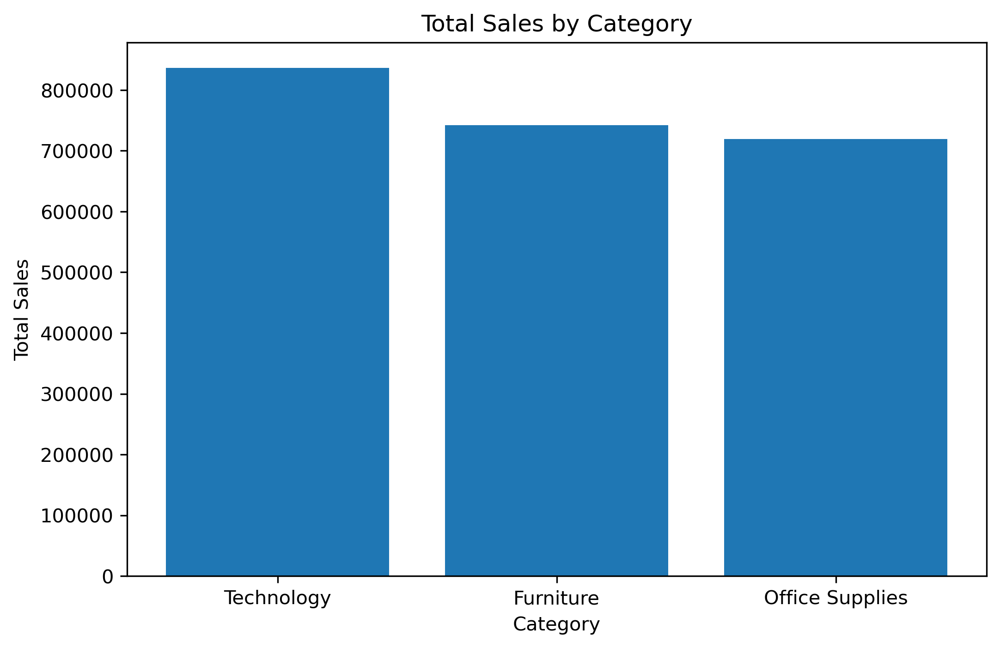
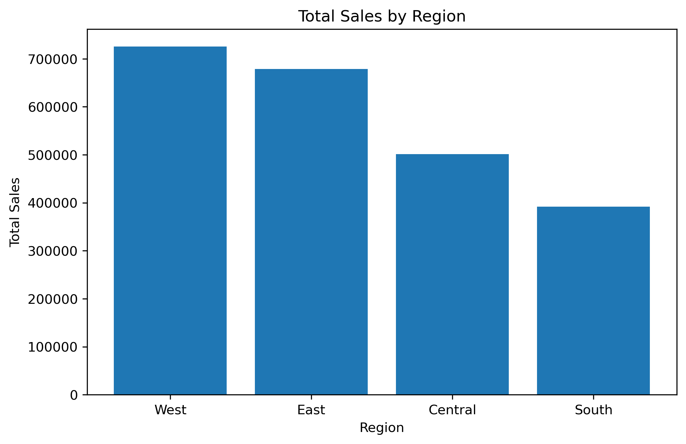
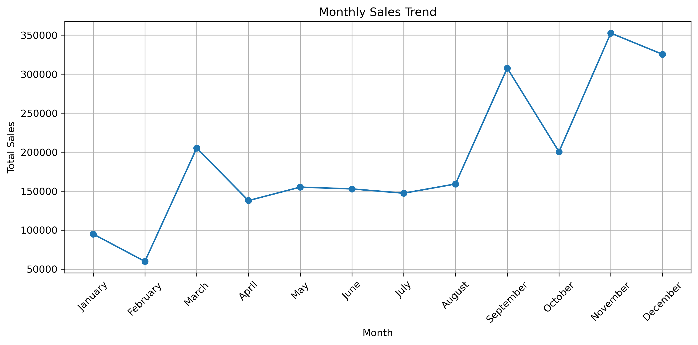
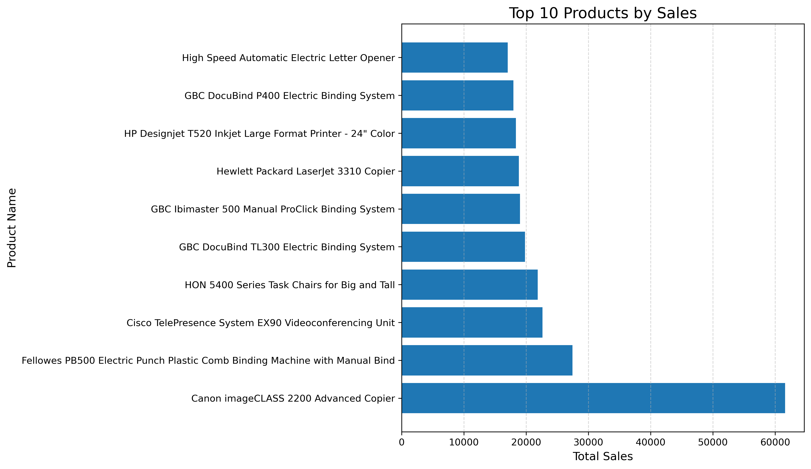
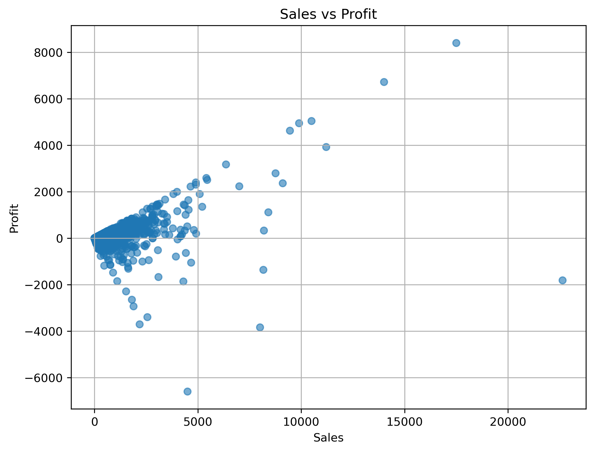

# 📊 Sales Data Analysis using SQL and Python

## 📌 Project Overview

This project analyzes retail sales data using SQL (SQLite) and Python. The objective is to extract meaningful business insights, identify sales trends, evaluate product performance, and visualize key business metrics through data analysis techniques.

---

## 🎯 Objectives

- Analyze overall sales performance
- Identify top-performing categories and products
- Analyze regional and state-wise sales
- Evaluate customer purchasing behavior
- Study profit and discount trends
- Perform yearly and monthly sales trend analysis
- Visualize business insights using Python

---

## 🛠️ Technologies Used

- Python
- Pandas
- SQLite
- SQL
- Matplotlib
- Jupyter Notebook

---

## 📂 Project Structure

```
Sales-Data-Analysis/
│
├── data/
├── database/
├── images/
├── notebooks/
├── README.md
├── requirements.txt
└── .gitignore
```

---

## 📈 Analysis Performed

### SQL Analysis
- Business KPIs
- Category Analysis
- Region Analysis
- Top Customers
- Top Products
- State-wise Sales Analysis
- Profit Analysis
- Discount Analysis

### Python Analysis
- Date Conversion
- Year-wise Sales Trend
- Monthly Sales Trend
- Sales vs Profit Analysis

---

## 💡 Key Business Insights

- Technology is one of the highest revenue-generating categories.
- Sales performance varies across different regions and states.
- A small number of customers contribute significantly to total sales.
- Some high-sales transactions generate low or negative profit.
- Discount strategies should be optimized to improve profitability.
- Sales show strong seasonal trends during certain months.

---

## 📊 Sample Visualizations

### Category-wise Sales



### Region-wise Sales



### Monthly Sales Trend



### Top 10 Products



### Sales vs Profit Analysis



---

## 🚀 Conclusion

This project demonstrates practical skills in SQL, SQLite, Python, Pandas, and data visualization for retail sales analysis. The insights generated can support business decision-making and strategic planning.
